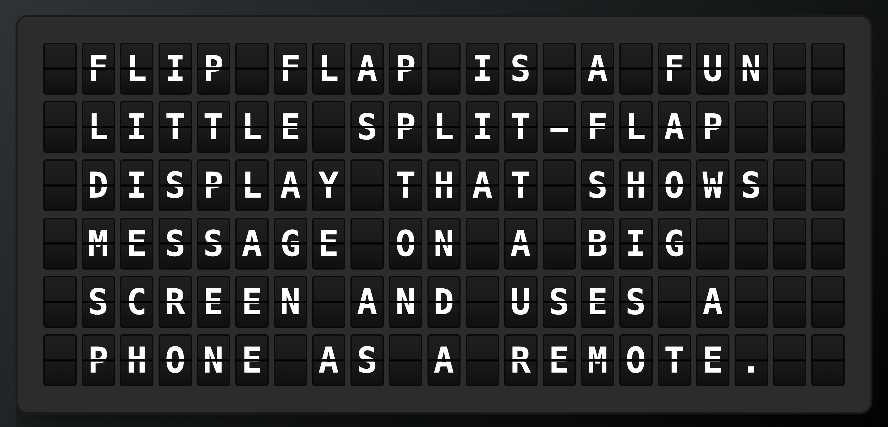

## Flip Flap



A minimalist split‑flap style message board that runs on the web (for the display and remote) and on Apple TV (tvOS).  
The display shows a grid of animated split‑flap cells; a separate “remote” page or the tvOS app sends text to show via Firebase.

---

## Features

- **Big‑screen display**: Full‑screen split‑flap board (`index.html`) intended for an iPad or desktop display.
- **Remote control**: Phone‑friendly remote (`control.html`) to type or pick predefined messages.
- **Room pairing via QR code**:
  - The display generates a **room id** and shows a QR code.
  - Scanning the QR code opens the remote page already bound to that room.
- **Animated board**: Characters animate in a split‑flap style as the text changes.
- **Fun presets**:
  - “Random Quote” button that picks a quote from `quotes.json`.
  - "Funny Quote" button with humorous one-liners. Within 30 days of a holiday it offers quotes for that holiday.
- **Automatic cleanup**:
  - Each room document stores an `expiresAt` field.
  - A Firestore TTL policy on that field deletes a room 7 days after its last message (deletion can lag by about a day).
- **tvOS app**:
  - Mirrors the web display behavior on Apple TV.
  - Connects to the same Firebase project and room documents.

---

## Project Structure

- **Web app (static site, everything in `web/`; only that folder is published to flipflap.dgrlabs.co)**
  - `index.html` – Display page for the board.
  - `control.html` – Remote controller UI for phones.
  - `style.css` – Shared styling for display and remote.
  - `layout.js` – Turns a message into rows of characters (wrapping and centering). No DOM, so it can be tested.
  - `splitflap.js` – Split‑flap board rendering and animation.
  - `display.js` – Wires the display page to Firebase + QR code.
  - `control.js` – Wires the remote page to Firebase and presets.
  - `firebase-core.js` – Firebase config, app, and anonymous sign-in, shared by both pages.
  - `firebase-init.js` – Firestore for the display (the full SDK, for its realtime listener).
  - `firebase-lite.js` – Firestore for the remote (Firestore Lite, which only needs to write).
  - `docs/PROTOCOL.md` – Human‑readable description of the Firestore data model and protocol.

- **tvOS app** (current version: **1.1**, build 2)
  - `tvos/README.md` – tvOS‑specific notes.
  - `tvos/SplitFlapTV/` – SwiftUI tvOS project.
    - `FlipFlapApp.swift` – App entry point.
    - `ContentView.swift` – Top‑level UI.
    - `Models/RoomState.swift` – Board/room data model.
    - `ViewModels/RoomViewModel.swift` – Binds Firestore state to the views.
    - `Layout/BoardLayout.swift`, `Layout/BoardCharset.swift` – Swift port of `layout.js`. Both ports are tested against `shared/layout-fixtures.json` (`node --test tests/layout.test.mjs`, and `swift test` inside `tvos/`).
    - `Views/BoardView.swift`, `Views/QRCodeView.swift` – Main views.
    - `SoundEffects.swift` – Optional split‑flap sound effects.
    - `GoogleService-Info.plist` – Firebase config for tvOS. The tracked file points at our project, so swap in your own if you fork.

---

## How It Works (High‑Level)

1. **Room creation (display)**  
   - When `index.html` loads, `display.js`:
     - Generates a random `roomId`.
     - Initializes Firebase (via `firebase-init.js`).
     - Shows a QR code linking to `control.html?room=<roomId>`.
     - Listens to Firestore document `rooms/<roomId>` for changes.
   - The split‑flap board shows an initial empty message (configurable).

2. **Remote control (web)**  
   - `control.html` reads the `room` from the query string or hash.
   - It signs in anonymously via Firebase Auth, then writes to `rooms/<roomId>`:
     - `text`: the multi‑line text to display.
     - `updatedAt`: Firestore server timestamp.
     - `expiresAt`: JavaScript `Date` set to “now + 7 days” (for TTL cleanup).
     - `source`: `"manual" | "random" | "funny"`.

3. **Display update**  
   - On any change to the room document, the display receives the new `text` and:
     - Computes the layout for the 21×6 board.
     - Animates character changes using the split‑flap effect.

4. **tvOS app**  
   - Uses the same `rooms/<roomId>` documents as the web display.
   - Mirrors the animation and layout behavior described in `docs/PROTOCOL.md`.
   - Can show/hide the QR code using the Siri Remote.

---

## Prerequisites

- A **Firebase project** with:
  - **Cloud Firestore** enabled (in Native mode).
  - **Firebase Authentication** enabled with **Anonymous** sign‑in.
  - **Authorized domains** configured for your hosting domain (see below).
- A **Google Cloud project** linked to your Firebase project (automatically created by Firebase).
- Node not required: the web app is just static HTML/JS/CSS and can be hosted anywhere.
- For tvOS:
  - **Xcode** (latest stable) on macOS.
  - An Apple TV or tvOS simulator.

---

## Firebase Configuration (Web)

1. In the Firebase console, go to **Project settings → General → Your apps**.
2. Under **Web apps**, either:
   - Use the existing app for this project, or
   - Register a new web app (no hosting required).
3. Copy the `firebaseConfig` block and paste it into `firebase-core.js`:

```js
const firebaseConfig = {
  apiKey: "…",
  authDomain: "…",
  projectId: "…",
  storageBucket: "…",
  messagingSenderId: "…",
  appId: "…",
};
```

4. Configure your **Firestore security rules** (see below).

---

## Firestore Security Rules

The rules are in [`firestore.rules`](firestore.rules) at the root of this repo. The app signs in anonymously, so the rules accept any signed-in user (`request.auth != null`). They also require room IDs to be 4 to 12 characters from A–Z and 0–9, allow reading one room at a time but never listing them, and deny deletes and everything outside the `rooms` collection. A write may only contain `text` (at most 1,000 characters), `source`, `updatedAt`, and `expiresAt`, and `expiresAt` is required so that no room can outlive the cleanup. Old rooms are removed by a Firestore TTL policy on `expiresAt`.

Deploy them with the Firebase CLI (`.firebaserc` names the project, so change it to yours first):

```bash
firebase deploy --only firestore:rules
```

You can also paste the file's contents into Firebase Console → Firestore → Rules.

You can check the rules before deploying with `python3 tests/rules_test.py`, which runs a table of allow and deny cases through Google's rules-test API. It needs `gcloud auth login` and the project name at the top of the script changed to yours.

---

## Authorized Domains

For anonymous authentication to work, your hosting domain must be authorized:

1. Go to **Firebase Console → Authentication → Settings → Authorized domains**
2. Click **Add domain**
3. Add your domain (e.g., `yourdomain.com`)

Without this, you'll see OAuth errors in the console and authentication will fail.

---

## API Key Restrictions

If you add HTTP referrer restrictions to your API key, ensure your domain is included:

1. Go to **Google Cloud Console → APIs & Services → Credentials**
2. Click on your web API key
3. Under **Application restrictions**, if set to "HTTP referrers":
   - Add `yourdomain.com/*`
   - Add `*.yourdomain.com/*` (for subdomains)
   - Add `localhost/*` for local development
4. Under **API restrictions**, ensure these APIs are allowed:
   - Cloud Firestore API (`firestore.googleapis.com`)
   - Identity Toolkit API (`identitytoolkit.googleapis.com`)
   - Token Service API (`securetoken.googleapis.com`)

Don't leave out the Token Service API. Firebase Auth refreshes ID tokens through it, and without it every refresh returns 403, so a page stops working about an hour after it loads.

Without correct referrer restrictions, Firestore real-time listeners will fail with CORS errors.

---

## Firebase Configuration (tvOS)

1. In the Firebase console, go to **Project settings → General → Your apps**.
2. Under **iOS apps**, either:
   - Use an existing iOS/tvOS app entry, or
   - Register a new app whose bundle ID matches the tvOS target’s bundle identifier.
3. Download the generated `GoogleService-Info.plist`.
4. In Xcode:
   - Drag `GoogleService-Info.plist` into the `SplitFlapTV` target.
   - Ensure **“Copy items if needed”** is checked and the **SplitFlapTV** target is selected in the “Add to targets” list.

The tvOS app will then use the same Firebase project and Firestore data as the web app.

---

## Running the Web App Locally

Because the app is 100% static, you can use any static file server. For example, with Python:

```bash
cd sf
python -m http.server 8000 -d web
```

Then:

1. Open `http://localhost:8000/index.html` on a big screen (iPad / desktop).  
2. Scan the QR code with your phone; it should open `control.html?room=…`.  
3. Type a message or use **Random Quote** / **Funny Quote**, then press **Display**.  
4. Watch the split‑flap board animate to the new text.

You can also host the files on any static host (Firebase Hosting, GitHub Pages, Netlify, etc.).

---

## Running the tvOS App

1. Open `tvos/SplitFlapTV/SplitFlapTV.xcodeproj` in Xcode.
2. Ensure your `GoogleService-Info.plist` is present and added to the **SplitFlapTV** target (see “Firebase Configuration (tvOS)” above).
3. Select a tvOS simulator or a physical Apple TV device.
4. Build and run.

The Apple TV display will connect to the configured room and mirror the split‑flap animation behavior of the web app.

---

## API Key Security Notes

For Firebase web and mobile apps, the `apiKey` in `firebaseConfig` is **not a secret**. It is:

- Used to identify your Firebase project to Google services.
- Expected to be embedded in client apps (web, iOS, Android, tvOS).

You should still harden it:

- In **Google Cloud Console → APIs & Services → Credentials**, find your Firebase web API key and:
  - Set **API restrictions** to only:
    - **Cloud Firestore API**
    - **Identity Toolkit API**
    - **Token Service API** (needed for ID token refresh)
  - Optionally set **HTTP referrer** restrictions for your production web host.
- Rely on strong **Firestore security rules** to protect your data.

If your key was previously unrestricted, rotate it (create a new key, update `firebaseConfig` and `GoogleService-Info.plist`, then delete the old key).

---

## Firestore TTL / Cleanup

Each room document written by the remote includes an `expiresAt` field set to 7 days in the future. To automatically delete stale rooms:

1. In the Firebase console, go to **Firestore Database → TTL (Time to Live)**.
2. Create a TTL policy for the `rooms` collection targeting the `expiresAt` field.
3. Set the retention you want (for example, delete documents when `expiresAt` is older than “now”).

This keeps your Firestore data size under control without manual cleanup.

---

## License

MIT License

&copy; 2026 DGR Labs, LLC

Permission is hereby granted, free of charge, to any person obtaining a copy
of this software and associated documentation files (the "Software"), to deal
in the Software without restriction, including without limitation the rights
to use, copy, modify, merge, publish, distribute, sublicense, and/or sell
copies of the Software, and to permit persons to whom the Software is
furnished to do so, subject to the following conditions:

The above copyright notice and this permission notice shall be included in
all copies or substantial portions of the Software.

THE SOFTWARE IS PROVIDED "AS IS", WITHOUT WARRANTY OF ANY KIND, EXPRESS OR
IMPLIED, INCLUDING BUT NOT LIMITED TO THE WARRANTIES OF MERCHANTABILITY,
FITNESS FOR A PARTICULAR PURPOSE AND NONINFRINGEMENT. IN NO EVENT SHALL THE
AUTHORS OR COPYRIGHT HOLDERS BE LIABLE FOR ANY CLAIM, DAMAGES OR OTHER
LIABILITY, WHETHER IN AN ACTION OF CONTRACT, TORT OR OTHERWISE, ARISING FROM,
OUT OF OR IN CONNECTION WITH THE SOFTWARE OR THE USE OR OTHER DEALINGS IN
THE SOFTWARE.

